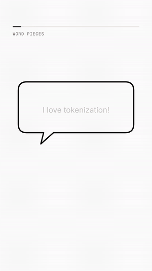
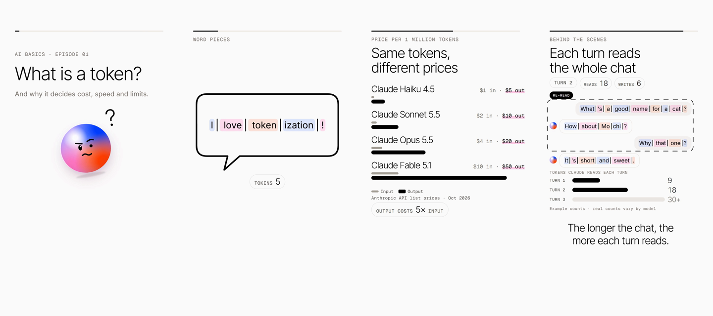

# AI basics shorts

Vertical (1080×1920, ≤ 60 s) animated shorts that teach AI basics in plain language.

## Preview

<p>
  
</p>



Episode 01 · What is a token? — [plain](episodes/ep01-tokens/renders/ep01-tokens.mp4) ·
[with narrator](episodes/ep01-tokens-narrator/renders/ep01-tokens-narrator.mp4)

## Built with

- [HyperFrames](https://hyperframes.heygen.com): each scene is an HTML page animated with
  [GSAP](https://gsap.com), rendered frame by frame to MP4.
- The Eggshell design system and Spark mascot (`studio/DESIGN.md`), with shared styles and motion
  helpers in `studio/assets/`.
- Node.js scripts for sound cues and voiceover ([Fish Audio](https://fish.audio) TTS), FFmpeg for audio
  and video.
- [Claude Code](https://claude.com/claude-code) with the HyperFrames skills to write and edit scenes.

## Set up on a new machine

1. Install [Node.js](https://nodejs.org) (LTS) and FFmpeg (`winget install Gyan.FFmpeg`), then open a
   new terminal so both are on `PATH`.
2. Clone the repo:

   ```sh
   git clone https://github.com/Sanjay-Deoram/ai-basics-shorts.git
   ```

3. Check an episode renders. The HyperFrames CLI runs through `npx`, so there is nothing else to install:

   ```sh
   cd episodes/ep01-tokens
   npm run dev       # preview in the browser
   npm run check     # expect 0 errors
   npm run render    # writes renders/*.mp4
   ```

4. For Claude Code, install the HyperFrames skills too (`npx hyperframes skills update`).

## Make a new video

```sh
cd studio
node tools/new-episode.mjs ep02-prompting   # copies the kit to episodes/ep02-prompting
cd ../episodes/ep02-prompting
# edit compositions/*.html and the scene slots in index.html (or ask Claude Code to)
node tools/build-sfx.mjs                    # place sound cues
npm run check                               # must pass with 0 errors
npm run dev                                 # scrub through it in the browser
npm run render                              # final 1080×1920 MP4 in renders/
```

For a narrated version, add a `voiceover.json` (copy the one in `episodes/ep01-tokens-narrator`),
write your lines, then run
`FISH_API_KEY=… node tools/voiceover.mjs`. Keep the key in the environment only, never in the repo.
